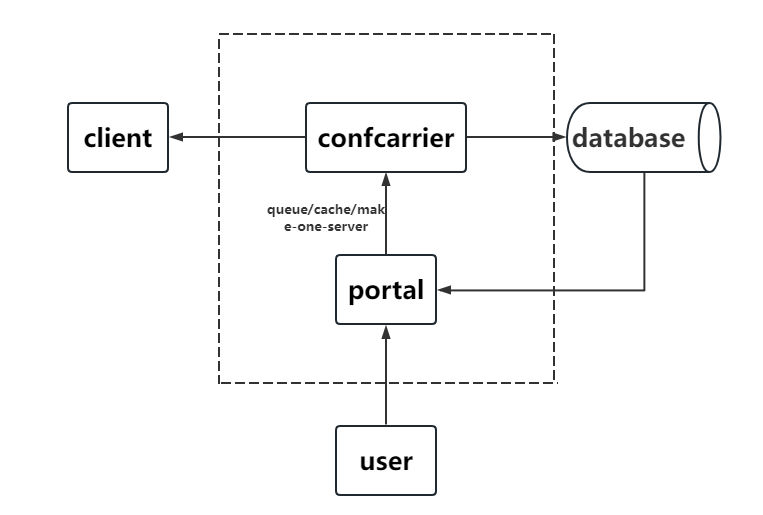

# GO版本分布式配置中心

[](http://www.apache.org/licenses/LICENSE-2.0.html)
[](https://travis-ci.com/data2/confcarrier)

GO版本分布式配置中心confcarrier
+ 支持端到端的实时通信，长连接减少资源损耗
+ 能够满足业务的丰富的配置操作
+ 发布订阅模式-服务端监听portal对配置的变动，并对客户端进行消息广播通知
+ 具备后台页面管理，web端操作配置

# architecture



# portal与confcarrier通信

+ queue message
+ cache
+ make-one-server

如果您是小型项目，可以使用make-one-server分支的代码，服务端和portal聚合为一个服务 https://github.com/data2/confcarrier/tree/make-one-big-server

# 使用
### 启动服务端
```
go run carrier.go  util.go db.go queue.go tcpPort  mysqlUrl redisUrl
```
### 启动客户端（分布式GO服务）
```
go run client.go  port  
```
### 启动portal
 ```
 go run portal.go  util.go db.go queue.go port  mysqlUrl redisUrl
 ```
